
작성자 : 윤정도

### 행동 패턴 <small>(Behavioral Pattern)</small>

* [전략](https://victorydntmd.tistory.com/292)
* [상태](https://victorydntmd.tistory.com/294)
* [템플릿 메소드](https://coding-factory.tistory.com/712)
* [커맨드](https://victorydntmd.tistory.com/295)
* [책임 연쇄](https://ko.wikipedia.org/wiki/%EC%B1%85%EC%9E%84_%EC%97%B0%EC%87%84_%ED%8C%A8%ED%84%B4)

### 전략 <small>(Strategy Pattern)</small>

`프로그램 실행중에(런타임에) 알고리즘을 선택할 수 있게 한다.`

예를들어 우리가 자체적으로 구현한 선형 자료구조가 있다고 하자
음.. 인터페이스 이름은 ICollections으로 지었다.

그러면 이 인터페이스를 실체화 하기위해 Array와 LinkedList를 구현하였다. 
이때 Array의 sort 함수는 버블함수로 정렬하도록 오버라이딩 하였고 
LinkedList는 sort함수를 선택정렬로 정렬하도록 오버라이딩하여 구현하였다.

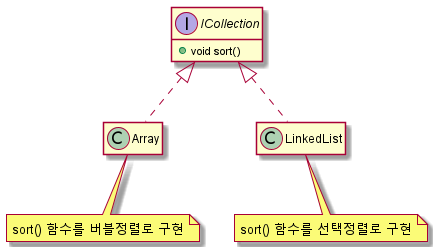 <small>OCP를 위반한 구조</small>  

만약 정렬 알고리즘을 통일시키거나 더 좋은 알고리즘이 있어서 변경해야할 경우 
둘 모두 오버라이딩된 sort() 함수를 수정해줘야 한다. 

그러면 OCP (Open-Closed Principle)에 위배되는 수정방식이 된다. 
OCP : 확장에 대해서는 개방(Open)되어있고 수정에 대해서는 닫혀있는(Closed)구조를 말한다. 

그렇다면 어떻게 하면 알고리즘을 선택적으로 수정할 수 있을까? 

내가 작성해놓은 UML과 코드를 보면 단 1초만에 파악할 수 있다.

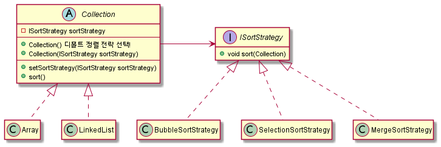 <small>내가 디자인한 전략 패턴 UML</small>  
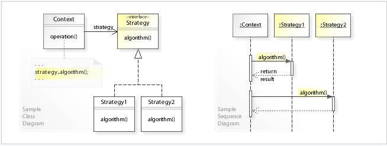 <small>위키피디아 전략 패턴 UML</small>  

### 상태 <small>(State Pattern)</small>

`상태에 대한 행동을 직접 처리하지 않고 상태 객체에 위임하는 패턴을 말한다.`

먼저 잘못된 예를 들어보자. 
게임을 플레이중인 유저가 있다. 

유저는 다음 움직임 상태가 있다고 가정하자. 
1. 걷고 있는 경우
2. 달리고 있는 경우
3. 멈춘 경우가 있을 수 있다.

이를 코드로 나타내면 다음과 같다.

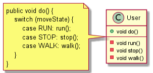 <small>OCP를 위반한 구조</small>  

우선 상태에 대한 행위를 수행하지만
위의 코드는 2가지 문제점을 안고 있다.

1. OCP 위반
2. 상태패턴의 정의 무시

첫번째 문제점에 대해서 생각해보자. 
만약 천천히 걷는 경우, 좀더 빠르게 달리고 있는 경우가 추가된다면 
우리는 기존 코드의 수정이 필요하다.

이는 OCP (Open-Closed Principle)에 위배되는 수정방식이 된다. 
OCP : 확장에 대해서는 개방(Open)되어있고 수정에 대해서는 닫혀있는(Closed)구조를 말한다. 

이제 두번째 문제점에 대해서 생각해보자 
상태패턴은 그 정의대로 상태에 해당하는 처리를 직접 User 객체가 수행하지 않고
상태 객체에 위임하여 처리해야한다.

하지만 위 코드는 User객체가 상태에 따른 처리를 모두 수행하기 때문에 상태패턴이라고 할 수 없다.  
그러면 OCP를 준수하면서 상태 패턴의 정의를 수행하는 코드를 작성해보자.

### 템플릿 메소드 <small>(Template Method Pattern)</small>

`작업을 수행하는 알고리즘(함수)의 기본 구조를 만들고 이를 서브 클래스로 만들어서 기본 구조는 바꾸지 않으면서 특정 단계에서 수행하는 알고리즘의 내용을 바꾸는 방법이다.`

예를들어 보겠다.

작업을 수행하는 알고리즘 : 라면을 요리한다. 
기본 구조(작업 순서) : 물을 넣는다. 그리고 라면을 넣는다. 기다린다! 
특정 단계에서 수행하는 알고리즘 : 물을 넣는다. or 라면을 넣는다 or 기다린다 

[장점]
1. 코드 중복 감소
2. 확장이 쉽다.
3. 자식 클래스의 역할을 감소시키면서 핵심 로직 관리 용이

[단점]
1. 추상 메소드가 너무 많아지면 클래스 관리가 복잡해진다.
2. 클래스간의 관계와 코드가 꼬여버릴 염려가 있다.

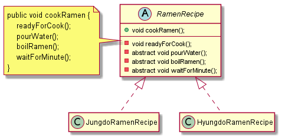 <small>내가 디자인한 템플릿 메소드 패턴 UML</small>  
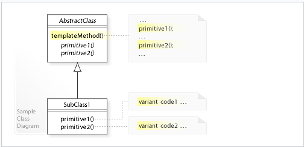 <small>위키피디아 템플릿 메소드 패턴 UML</small>  

### 커맨드 <small>(Command Pattern)</small>

`요청을 객체의 형태로 캡슐화하여 사용자가 보낸 요청을 원하는 시점에 수행할 수 있도록 하는 방법`

커맨드 패턴은 4개의 용어가 항상 따라다닌다.

1. 명령 (Command)  
   → 사용자의 요청
2. 발동자 (Invoker)  
   → 명령을 실행하는 객체
3. 수신자 (Receiver)  
   → 명령으로 실행되는 객체
4. 클라이언트 (Client)  
   → 사용자

예를들어 보겠다.

우리가 프로그램을 설치할 때 설치 프로그램을 실행하여 일련의 과정을 수행하여 최종적으로
설치를 마치게 된다.

이때 우리는 각 과정에 원하는 설정을 한 후 중간단계 또는 마지막에 설치가 이뤄지고
사용자는 설치 후의 작업에 대해 추가 설정을 한 후 최종적으로 유저가 Finish 버튼을 눌러서
설치를 완료하게 된다.

위 예시에서 커맨드 패턴을 이루는 원소에 해당하는 부분을 말해보겠다.

발동자(Invoker)  
→ 설치 프로그램(Wizard)에 해당한다.  
명령(Command)    
→ 각각의 페이지들  
수신자(Receiver)    
→ 페이지의 구체적인 내용이다.   
설치 경로를 지정하는 페이지는 설치 경로를 입력받는 텍스트 박스가 보여질 수 있다.  

한번 코드로 만들어보자.

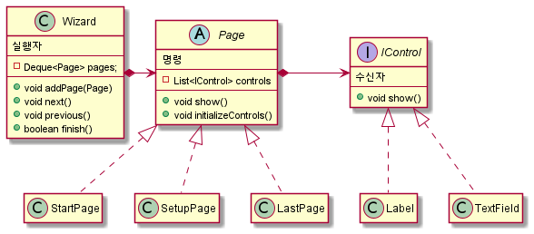 <small>내가 디자인한 커맨드 패턴 UML</small>  
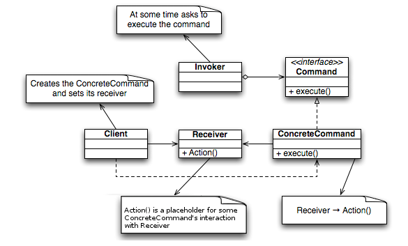 <small>위키피디아 커맨드 패턴 UML</small>  

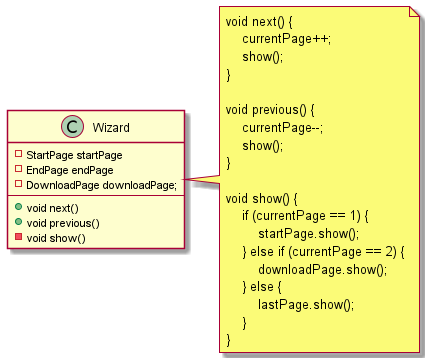 <small>OCP를 위반한 구조</small>  

만약 위와 같은 구조로 Wizard 클래스를 구현한다면 페이지(커맨드) 추가를 할 때마다 show() 함수의 수정이 필요해진다.

그리고 Wizard 클래스는 내부 필드 startPage, endPage, downloadPage에 의존성을 가지기 때문에 필수적으로 
객체의 정보를 주입해줘야한다.

### 책임 연쇄 <small>(Chain Of Responsibility Pattern)</small>

`어떤 요청이 그 요청을 담당하는 객체에 들어오면 해당 요청이 수행 가능할 경우 수행하고 수행하지 못할 경우 다음 요청 수행자에게 책임을 넘기는 방식을 말한다.`

2가지 예를 보면 쉽게 이해할 수 있다.

1. 문서 승인
2. 로그 남기기

**문서 승인을 예로들면** 
어떤 일반 문서는 팀장까지 승인을 받는다. 
하지만 중요 문서의 경우 팀장을 거쳐서 부장, 사장 까지 승인을 받는 경우가 있을 수 있다. 

**로그 남기기를 예로들면** 
* 정보 로그 = 1
* 디버그 로그 = 2
* 에러 로그 = 3

각 로그 상수의 숫자를 비교하여 우선순위에 따라 출력될지 말지를 결정할 수 있도록 만들 수 있다.

[어떤 문제를 해결할 수 있는가?]
1. 요청과 이를 처리하는 수신자간의 커플링이 없어야하는 경우
2. 요청을 처리하는 수신자가 하나 이상일 경우

[데코레이터 패턴과의 비교]  
데코레이터 패턴과 구조적으로 거의 일치한다.  
데코레이터 패턴의 경우 모든 클래스가 요청을 수행하지만  
책임 연쇄 패턴의 경우 단 하나의 클래스만 요청을 수행한다.

하지만 대부분의 연쇄 패턴의 경우 구현이 여러 클래스가 요청을 수행하도록 만든다.  
예를들어 UI Event 핸들링, 서블릿 필터 등이 있다.

[OCP, SRP 위반 예시]
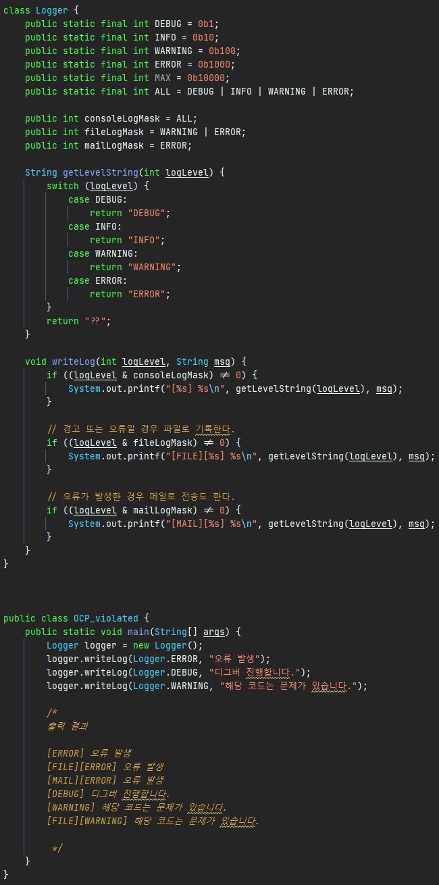 <small>OCP, SRP를 위반한 구조</small>  

로그를 남기는 함수에서 파일로 쓰는 기능, 메일로 전송하는 기능까지 수행하기 때문에 SRP를 위반하고 있다. 
다른 방식이 추가되면 writeLog 함수 수정이 필요하기 때문에 OCP도 위반한다.

COR(Chain Of Responsibiliy)을 사용하여 이를 해결해보자.

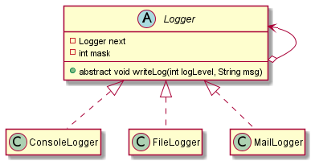 <small>내가 디자인한 책임 연쇄 패턴 UML</small>  
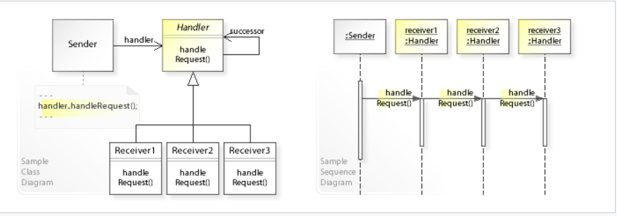 <small>위키피디아 책임 연쇄 패턴 UML</small>  

