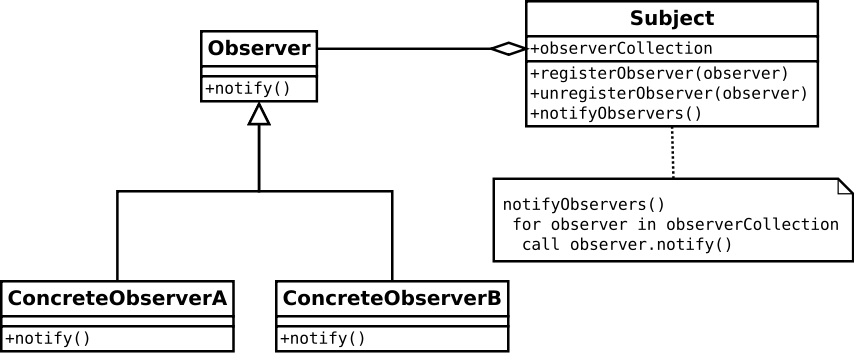

작성자 : 윤정도

### 행동 패턴 <small>(Behavioral Pattern)</small>

* [전략](https://victorydntmd.tistory.com/292)
* [상태](https://victorydntmd.tistory.com/294)
* [템플릿 메소드](https://coding-factory.tistory.com/712)
* [커맨드](https://victorydntmd.tistory.com/295)
* [책임 연쇄](https://ko.wikipedia.org/wiki/%EC%B1%85%EC%9E%84_%EC%97%B0%EC%87%84_%ED%8C%A8%ED%84%B4)
* [옵저버](https://ko.wikipedia.org/wiki/%EC%98%B5%EC%84%9C%EB%B2%84_%ED%8C%A8%ED%84%B4)
* [메멘토](https://songhayoung.github.io/2020/08/26/Design%20Pattern/MementoPattern/)
* [중재자](https://palpit.tistory.com/entry/Design-Pattern-%EC%A4%91%EC%9E%AC%EC%9E%90Mediator-%ED%8C%A8%ED%84%B4-%EB%94%94%EC%9E%90%EC%9D%B8-%ED%8C%A8%ED%84%B4)
* [방문자](https://icksw.tistory.com/261)
* [반복자](https://ko.wikipedia.org/wiki/%EB%B0%98%EB%B3%B5%EC%9E%90_%ED%8C%A8%ED%84%B4)

### 전략 <small>(Strategy Pattern)</small>

`프로그램 실행중에(런타임에) 알고리즘을 선택할 수 있게 한다.`

예를들어 우리가 자체적으로 구현한 선형 자료구조가 있다고 하자
음.. 인터페이스 이름은 ICollections으로 지었다.

그러면 이 인터페이스를 실체화 하기위해 Array와 LinkedList를 구현하였다. 
이때 Array의 sort 함수는 버블함수로 정렬하도록 오버라이딩 하였고 
LinkedList는 sort함수를 선택정렬로 정렬하도록 오버라이딩하여 구현하였다.

 <small>OCP를 위반한 구조</small>  

만약 정렬 알고리즘을 통일시키거나 더 좋은 알고리즘이 있어서 변경해야할 경우 
둘 모두 오버라이딩된 sort() 함수를 수정해줘야 한다. 

그러면 OCP (Open-Closed Principle)에 위배되는 수정방식이 된다. 
OCP : 확장에 대해서는 개방(Open)되어있고 수정에 대해서는 닫혀있는(Closed)구조를 말한다. 

그렇다면 어떻게 하면 알고리즘을 선택적으로 수정할 수 있을까? 

내가 작성해놓은 UML과 코드를 보면 단 1초만에 파악할 수 있다.

 <small>내가 디자인한 전략 패턴 UML</small>  
 <small>위키피디아 전략 패턴 UML</small>  

### 상태 <small>(State Pattern)</small>

`상태에 대한 행동을 직접 처리하지 않고 상태 객체에 위임하는 패턴을 말한다.`

먼저 잘못된 예를 들어보자. 
게임을 플레이중인 유저가 있다. 

유저는 다음 움직임 상태가 있다고 가정하자. 
1. 걷고 있는 경우
2. 달리고 있는 경우
3. 멈춘 경우가 있을 수 있다.

이를 코드로 나타내면 다음과 같다.

 <small>OCP를 위반한 구조</small>  

우선 상태에 대한 행위를 수행하지만
위의 코드는 2가지 문제점을 안고 있다.

1. OCP 위반
2. 상태패턴의 정의 무시

첫번째 문제점에 대해서 생각해보자. 
만약 천천히 걷는 경우, 좀더 빠르게 달리고 있는 경우가 추가된다면 
우리는 기존 코드의 수정이 필요하다.

이는 OCP (Open-Closed Principle)에 위배되는 수정방식이 된다. 
OCP : 확장에 대해서는 개방(Open)되어있고 수정에 대해서는 닫혀있는(Closed)구조를 말한다. 

이제 두번째 문제점에 대해서 생각해보자 
상태패턴은 그 정의대로 상태에 해당하는 처리를 직접 User 객체가 수행하지 않고
상태 객체에 위임하여 처리해야한다.

하지만 위 코드는 User객체가 상태에 따른 처리를 모두 수행하기 때문에 상태패턴이라고 할 수 없다.  
그러면 OCP를 준수하면서 상태 패턴의 정의를 수행하는 코드를 작성해보자.

### 템플릿 메소드 <small>(Template Method Pattern)</small>

`작업을 수행하는 알고리즘(함수)의 기본 구조를 만들고 이를 서브 클래스로 만들어서 기본 구조는 바꾸지 않으면서 특정 단계에서 수행하는 알고리즘의 내용을 바꾸는 방법이다.`

예를들어 보겠다.

작업을 수행하는 알고리즘 : 라면을 요리한다. 
기본 구조(작업 순서) : 물을 넣는다. 그리고 라면을 넣는다. 기다린다! 
특정 단계에서 수행하는 알고리즘 : 물을 넣는다. or 라면을 넣는다 or 기다린다 

[장점]
1. 코드 중복 감소
2. 확장이 쉽다.
3. 자식 클래스의 역할을 감소시키면서 핵심 로직 관리 용이

[단점]
1. 추상 메소드가 너무 많아지면 클래스 관리가 복잡해진다.
2. 클래스간의 관계와 코드가 꼬여버릴 염려가 있다.

 <small>내가 디자인한 템플릿 메소드 패턴 UML</small>  
 <small>위키피디아 템플릿 메소드 패턴 UML</small>  

### 커맨드 <small>(Command Pattern)</small>

`요청을 객체의 형태로 캡슐화하여 사용자가 보낸 요청을 원하는 시점에 수행할 수 있도록 하는 방법`

커맨드 패턴은 4개의 용어가 항상 따라다닌다.

1. 명령 (Command)  
   → 사용자의 요청
2. 발동자 (Invoker)  
   → 명령을 실행하는 객체
3. 수신자 (Receiver)  
   → 명령으로 실행되는 객체
4. 클라이언트 (Client)  
   → 사용자

예를들어 보겠다.

우리가 프로그램을 설치할 때 설치 프로그램을 실행하여 일련의 과정을 수행하여 최종적으로
설치를 마치게 된다.

이때 우리는 각 과정에 원하는 설정을 한 후 중간단계 또는 마지막에 설치가 이뤄지고
사용자는 설치 후의 작업에 대해 추가 설정을 한 후 최종적으로 유저가 Finish 버튼을 눌러서
설치를 완료하게 된다.

위 예시에서 커맨드 패턴을 이루는 원소에 해당하는 부분을 말해보겠다.

발동자(Invoker)  
→ 설치 프로그램(Wizard)에 해당한다.  
명령(Command)    
→ 각각의 페이지들  
수신자(Receiver)    
→ 페이지의 구체적인 내용이다.   
설치 경로를 지정하는 페이지는 설치 경로를 입력받는 텍스트 박스가 보여질 수 있다.  

한번 코드로 만들어보자.

 <small>내가 디자인한 커맨드 패턴 UML</small>  
 <small>위키피디아 커맨드 패턴 UML</small>  

 <small>OCP를 위반한 구조</small>  

만약 위와 같은 구조로 Wizard 클래스를 구현한다면 페이지(커맨드) 추가를 할 때마다 show() 함수의 수정이 필요해진다.

그리고 Wizard 클래스는 내부 필드 startPage, endPage, downloadPage에 의존성을 가지기 때문에 필수적으로 
객체의 정보를 주입해줘야한다.

### 책임 연쇄 <small>(Chain Of Responsibility Pattern)</small>

`어떤 요청이 그 요청을 담당하는 객체에 들어오면 해당 요청이 수행 가능할 경우 수행하고 수행하지 못할 경우 다음 요청 수행자에게 책임을 넘기는 방식을 말한다.`

2가지 예를 보면 쉽게 이해할 수 있다.

1. 문서 승인
2. 로그 남기기

**문서 승인을 예로들면** 
어떤 일반 문서는 팀장까지 승인을 받는다. 
하지만 중요 문서의 경우 팀장을 거쳐서 부장, 사장 까지 승인을 받는 경우가 있을 수 있다. 

**로그 남기기를 예로들면** 
* 정보 로그 = 1
* 디버그 로그 = 2
* 에러 로그 = 3

각 로그 상수의 숫자를 비교하여 우선순위에 따라 출력될지 말지를 결정할 수 있도록 만들 수 있다.

[어떤 문제를 해결할 수 있는가?]
1. 요청과 이를 처리하는 수신자간의 커플링이 없어야하는 경우
2. 요청을 처리하는 수신자가 하나 이상일 경우

[데코레이터 패턴과의 비교]  
데코레이터 패턴과 구조적으로 거의 일치한다.  
데코레이터 패턴의 경우 모든 클래스가 요청을 수행하지만  
책임 연쇄 패턴의 경우 단 하나의 클래스만 요청을 수행한다.

하지만 대부분의 연쇄 패턴의 경우 구현이 여러 클래스가 요청을 수행하도록 만든다.  
예를들어 UI Event 핸들링, 서블릿 필터 등이 있다.

[OCP, SRP 위반 예시]
 <small>OCP, SRP를 위반한 구조</small>  

로그를 남기는 함수에서 파일로 쓰는 기능, 메일로 전송하는 기능까지 수행하기 때문에 SRP를 위반하고 있다. 
다른 방식이 추가되면 writeLog 함수 수정이 필요하기 때문에 OCP도 위반한다.

COR(Chain Of Responsibiliy)을 사용하여 이를 해결해보자.

 <small>내가 디자인한 책임 연쇄 패턴 UML</small>  
 <small>위키피디아 책임 연쇄 패턴 UML</small>  

### 옵저버 <small>(Observer Pattern)</small>

`어떤 객체의 상태가 변할 때 그와 연관된 객체 들에게 알림을 보내는 방법`

주로 이벤트 핸들링 시스템에 사용된다.  

옵저버라는 단어를 가장 쉽게 이해하는 방법이 스타크래프트의 옵저버 유닛을 예로 들 수 있다.  
옵저버는 주변 상태변화를 관찰하고 이를 게임을 플레이하거나 관전중인 유저들에게 알려주는 역할을 수행한다.

이제 옵저버 패턴에 걸맞는 예시를 들어보겠다.  
나는 콘솔창에서 발생할 다음 2가지 상태변화시 원하는 기능을 수행하고 싶다.

1. 콘솔창에 출력을 할 때
2. 콘솔창에 입력을 할 때

이를 위해 2가지 클래스를 정의하였다.  

콘솔을 관찰할 수 있는 클래스 : ConsoleObservable (콘솔 옵저버블)
콘솔을 관찰할 인터페이스 : ConsoleObserver (콘솔 옵저버)  
입,출력 콘솔 : ConsoleManager

아래와 같은 구조를 뛴다.

 <small>내가 디자인한 옵저버 패턴 UML</small>  

어디서 많이 본 구조이다.  
C#의 이벤트와 동작방식이 같다 ㅋㅋ  

1. 콘솔의 write 함수 호출 시  
&nbsp;&nbsp;&nbsp;콘솔의 출력 발생 → 콘솔 출력 옵저버블이 옵저버들에게 정보 전달 → 각 옵저버들마다 정보 수신
2. 콘솔의 read 함수 호출 시  
&nbsp;&nbsp;&nbsp;콘솔의 입력 발생 → 콘솔 입력 옵저버블이 옵저버들에게 정보 전달 → 각 옵저버들마다 정보 수신

 <small>위키피디아 옵저버 패턴 UML</small>  

### 메멘토 <small>(Memento Pattern)</small>

`객체를 이전 상태로 되돌릴 수 있는 기능을 제공하는 디자인 패턴이다.`

메멘토 패턴은 3개의 객체로 구현된다.

1. 오리지네이터(originator)  
&nbsp;&nbsp;&nbsp;사전적 의미 : 창작자, 창설자, 창시자, 발기인, 시조  
&nbsp;&nbsp;&nbsp;역할 : 상태를 가지고 있는 객체  
&nbsp;&nbsp;&nbsp;예시 : 오목 게임 보드(오목판 같은?)  

2. 케어테이커(caretaker)  
&nbsp;&nbsp;&nbsp;사전적 의미 : 경비원, 관리인, 돌보는 사람  
&nbsp;&nbsp;&nbsp;역할 : 상태를 관리하는 객체  
&nbsp;&nbsp;&nbsp;예시 : 오목 기보 기록자  
   
3. 메멘토(memento)  
&nbsp;&nbsp;&nbsp;사전적 의미 : (사람·장소를 기억하기 위한) 기념품  
&nbsp;&nbsp;&nbsp;역할 : 상태  
&nbsp;&nbsp;&nbsp;예시 : 오목알 위치

[장점]
1. 상태기록을 오리지네이터가 하지않고 케어테이커로 분리되어 수행되기 때문에 코드 복잡성이 감소한다.
2. 복구 기능을 구현하기가 쉽다.
3. 캡슐화를 훼손하지 않고 오리지네이터의 내부 상태를 저장하고 복구할 수 있게해준다.

케어테이커는 오리지네이터에게 메멘토를 요청하고(오리지네이터의 내부 상태를 저장하기 위해) 관리하고 있다가 오리지네이터에게 메멘토를 다시 돌려줄 수 있다(이전 상태로 복구하기 위해). 

[단점]
1. 상태를 저장하고 복구하는 데 시간이 오래 걸리 수 있다는 단점이 있다.  
    → 왜 오래 걸리지? 흠.. 오래 안걸리게 만들면 안되나?

예를들어 보자.

프로 오목대회가 개최되었다.  
선수 2명이 오목판에 돌을 두고 있다.  
그리고 기보를 기록하는 사람이 선수들이 돌을 둘 때마다 오목알의 위치를 기보에 기록 한다.

여기서!

오목판 : 오리지네이터  
기보 기록자 : 케어테이커  
오목알의 위치 : 메멘토  

가 될 수 있다. 한번 코드로 옮겨보자

 <small>내가 디자인한 메멘토 패턴 UML</small>  
 <small>튜토리얼 포인트 메멘토 패턴 UML</small>  

### 중재자 <small>(Mediator Pattern)</small>

`객체간의 직접적인 통신을 피하기 위해 중간 객체를 만들어 중간 객체를 통해 다른 객체와 통신하는 방법이다.`

우선 중재자를 사용하지 않을 경우를 예를 들어보자  

부동산 중개업자 클래스가 없고 집주인, 입주자, 수리기사, 가구 4종류 클래스가 존재한다.  
만약 부동산 중개업자가 없을 경우의 UML을 그려보자.  

 <small>중재자 미사용 UML</small>  

매우 복잡한 구조가 탄생했다.  
내가 만들었지만 이 구조는 나도 나중에 보면 눈이 핑핑 돌기 때문에 나눠서 설명하겠다.

먼저 건물주부터 의존관계를 확인해보자. 
 <small>건물주 기준 의존관계도</small>  

1. 건물주는 입주자에게 방을 판매할 수 있다  
2. 건물주는 가구들을 많이 가지고 있다.  
3. 건물주는 수리기사에게 수리를 요청 할 수 있다.

이제 입주자의 의존관계를 확인해보자. 
 <small>입주자 기준 의존관계도</small>  

1. 입주자는 건물주에게 방을 요청할 수 있다.
2. 입주자는 수리기사에게 가구 수리를 요청할 수 있다.
3. 건물주는 수리기사에게 수리를 요청 할 수 있다.

수리기사의 의존관계를 확인해보자. 
 <small>수리기사 기준 의존관계도</small>  

1. 수리기사는 건물주의 가구를 수리해줄 수 있다.

이렇게 서로 강하게 연결되어 있다.  
그러면 이제 부동산 중개업자를 둬서 이 답답함을 해소해보자.

 <small>내가 디자인한 중재자 패턴 UML</small>  
 <small>위키피디아 중재자 패턴 UML</small>  

### 방문자 <small>(Visitor Pattern)</small>

`알고리즘(기능)을 객체에서 분리시키는 디자인 패턴`

예를들어 동그라미, 사각형, 육각형 도형들이 있다. 
그리고 이 도형들은 배경색, 전경색, 위치 프로퍼티들을 가지고있다 
이를 클래스로 표현해보면 아래와 같다. 

 <small>기능 분리 전</small>  

도형은 다음의 기능을 가지고 있다.

1. 배경색 변경기능 - setBackgroundColor()
2. 전경색 변경기능 - setForegroundColor()
3. 위치 변경기능 - setPosition()
4. 도형정보 출력기능 - printInfo()

이를 방문자 패턴을 적용하여 도형과 기능을 분리해보자.

 <small>내가 디자인한 방문자 패턴 UML (버전1)</small>  

방문자 패턴을 적용하여 Shape 클래스에서 기능이 분리되어나온 Visitor 객체들이 생겼다. 

정리하자면 다음과 같다.

1. Shape 클래스의 구조가 매우 단순해졌다.
2. Shape 클래스의 기능들이 분리되고 모두 객체화 되었다.

즉 이는 클래스 OCP를 준수하기 매우 적합한 구조로 변모했음을 알 수 있다. 
왜 OCP를 준수하기 좋은 구조인가? 

우리는 도형에 기능을 추가할 때 Shape 클래스의 코드를 수정하지 않고 방문자(Visitor)객체를
추가 함으로써 OCP를 준수할 수 있기때문이다.

물론 단점도 있어보인다. 
기능 각각마다 클래스가 만들어지므로 클래스 관리가 점점 어려워질 수 있어보인다.

아.. 사실 구조를 만들면서 뿜어져나온 내 생각을 적은거라.. 뭐.. ㅠㅠ 
다른 사람 적은거좀 봐야겠다. 

 

 <small>위키피디아 방문자 패턴 UML</small>  

Shape의 기능이 모두 객체로 분리되어 실행되는 모습을 확인할 수 있었다.

우선 방문자 패턴이 쓰이는 경우를 확인하고 다시 분석해보자.

[방문자 패턴을 사용하는 경우]
1. 복잡한 구조의 모든 원소들에 대해 방문(visit)하여 작업을 수행해야할 경우
2. 클래스 계층 구조에서 몇몇 단계에 있는 클래스에만 기능을 사용하고자 할 경우

1번은 확실히 잘 수행되고 있다.
하지만 2번은 아예 적용되지 않은 모습이다.

각 방문자 객체마다 모든 도형에 대해서 기능을 적용시키기 때문이다. 
2번을 확인할려면 visitor의 수정이 좀 필요하다. 
2번 구조도 확인 가능하도록 한번 다시 수정해보겠다. 

 <small>내가 디자인한 방문자 패턴 버전2 UML</small>  

배경색, 전경색, 정보 출력기능을 제거했다. 
그리고 움직임에 대한 제어기능을 추가해보았다. 

* HaxagonPositioningShapeVisitor : 육각형만 움직일 수 있다.
* RectanglePositioningShapeVisitor : 사각형만 움직일 수 있다.
* CirclePositioningShapeVisitor : 동그라미만 움직일 수 있다.

한번 버전1과 버전2 모두 코드로 옮겨보자 

### 반복자 <small>(Iterator Pattern)</small>

`컨테이너를 순회하고 요소들에 접근하기 위한 디자인 패턴이다.`

반복자 패턴은 컨테이너와 기능을 분리시킨다. 
일부 컨테이너의 특화된 기능들의 경우에는 분리가 불가능하다.

[특징]
1. 컨테이너 객체는 내부 구조를 노출하지 않고 원소들에 접근하는 방법을 제공한다.
2. 컨테이너의 인터페이스를 변경하지 않고 새로운 순회 기능을 제공할 수 있다.

 <small>내가 디자인한 반복자 패턴 UML</small>  
 <small>위키피디아 반복자 패턴 UML</small>  