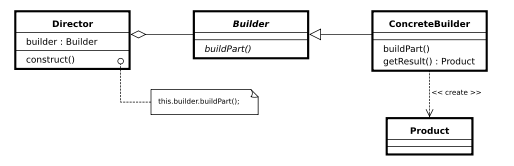

<p align="center">작성자 : 윤정도</p>

### 생성 패턴 <small>(Creational Pattern)</small>

* [팩토리](https://youtu.be/AmwEIt0vhxA?list=PLDV-cCQnUlIYcAmW4j27i8aYPbja9HePm) 
* [팩토리 메소드](https://youtu.be/ejXUhFKcbIU?list=PLDV-cCQnUlIYcAmW4j27i8aYPbja9HePm)
* [추상 팩토리](https://youtu.be/XTgCYtQAQ4c?list=PLDV-cCQnUlIYcAmW4j27i8aYPbja9HePm)
* [빌더](https://youtu.be/qWiqt5EctSE?list=PLDV-cCQnUlIYcAmW4j27i8aYPbja9HePm)
* [싱글톤](https://youtu.be/-oy5jOd5PBg?list=PLDV-cCQnUlIYcAmW4j27i8aYPbja9HePm)
* [프로토타입](https://youtu.be/F7dVyB48grs?list=PLDV-cCQnUlIYcAmW4j27i8aYPbja9HePm)

<hr>

### 팩토리 <small>(Factory Pattern)</small>
복잡한 생성과정을 피하기 위함이다.<br>
클라이언트가 컴퓨터를 원한다면 컴퓨터의 복잡한 생성과정을 피하고
단순히 공장에 주문을 넣는 것으로 쉽게 획득할 수 있다.<br>
즉, 클라이언트가 컴퓨터의 생성과정을 몰라도 된다.

<br><small>내가 디자인한 팩토리 패턴 UML</small><br><br>

<hr>

### 팩토리 메소드 <small>(Factory Method Pattern)</small>
```객체를 만들어내는 부분을 서브 클래스에 위임하는 패턴```  
팩토리 패턴을 좀 더 확장시켜서 다양한 기능을 가진 팩토리를 구현하고자할 때 좋다.  
객체를 만들어내는 부분 : <span style="text-decoration: underline">createComputer</span>  
서브 클래스 : <span style="text-decoration: underline">NormalComputerFactory, SuperComputerFactory</span>   
 
<br><small>내가 디자인한 팩토리 메소드 패턴 UML</small><br><br>
<br><small>위키피디아 팩토리 메소드 패턴 UML</small><br><br>

<hr>

### 추상 팩토리 <small>(Abstract Factory Pattern)</small>

```많은 수의 연관된 서브 클래스를 특정 그룹으로 묶어 한번에 교체할 수 있도록 만든 디자인 패턴```<br>
예를 들어서 우리가 사용하는 인텔리제이 테마가 검정색 테마와 하얀색 테마가 있다고 생각해보자.<br>
검정색 테마를 사용할 경우 검은색 버튼, 검은색 스크롤바, 검은색 체크박스로 보일테고<br>
하얀색 테마를 사용할 경우 하얀색 버튼, 하얀색 스크롤바, 하얀색 체크박스로 보일것이다.<br>

<br><small>내가 디자인한 추상 팩토리 패턴 UML (클라이언트 제외)</small><br><br>
<br><small>위키피디아 추상 팩토리 패턴 UML</small><br><br>

<hr>

### 빌더 <small>(Builder Pattern)</small>

```다양한 생성인자를 받는 오브젝트를 좀더 유연하게 생성해주고 복잡한 생성과정을 분리해주는 GOF 디자인 패턴중의 하나이다.```<br>
[위키피디아 링크](https://en.wikipedia.org/wiki/Builder_pattern)


<br><small>내가 디자인한 빌더 패턴 UML</small><br><br>
<br><small>위키피디아 빌더 패턴 UML</small><br><br>


#### 장점

* 필요한 데이터만 설정할 수 있음
* 유연성을 확보할 수 있음
* 가독성을 높일 수 있음
* 불변성을 확보할 수 있음

<hr>

### 싱글톤 <small>(Singleton Pattern)</small>

`전반적인 시스템에 걸쳐서 단 하나의 객체만 필요한 경우에 사용 (단 하나의 인스턴스만 존재하는 클래스)`<br>
[위키피디아 링크](https://en.wikipedia.org/wiki/Singleton_pattern)

#### 종류
* 이른 로딩 싱글톤 (무조건 쓰레드 세이프)<br>
  &nbsp;&nbsp;&nbsp;&nbsp; → 프로그램 시작과 동시에 싱글톤 인스턴스가 생성     
* 늦은 로딩 싱글톤<br>
  &nbsp;&nbsp;&nbsp;&nbsp; → 사용자가 원하는 시점에 싱글톤 인스턴스가 생성
  * 동기화 함수 싱글톤
  * 내부 클래스 싱글톤
  * 더블 체크드 락킹 싱글톤

<hr>

### 프로토타입 <small>(Prototype Pattern)</small>

`이미 존재하는 객체를 기반으로 생성하는 디자인 패턴`<br>
생성할 객체의 타입이 이미 존재하는 객체(인스턴스)로부터 결정된다.

* new 를 이용해서 생성하는 비용이 매우 클 때 사용한다.<br>
  → 만약 생성시마다 DB에 접근하는 경우라면 이미 존재하는 객체를 클론하여 쓰는게 훨씬 비용이 싸다.   

<br><small>내가 디자인한 프로토타입 패턴 UML</small><br><br>
<br><small>위키피디아 프로토타입 패턴 UML</small><br><br>