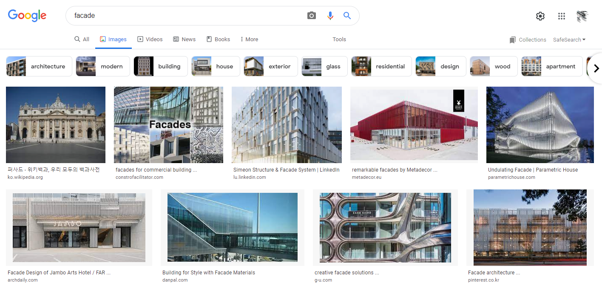

작성자 : 윤정도

### 구조 패턴 <small>(Structural Pattern)</small>

* [어댑터](https://youtu.be/IHU-wDglGM0?list=PLDV-cCQnUlIaOFXCUv8vEMGxqzrrkGv_P)
* [프록시](https://youtu.be/oeavBf8eDu8?list=PLDV-cCQnUlIaOFXCUv8vEMGxqzrrkGv_P)
* [퍼사드](https://youtu.be/wC-aEK_xc7c?list=PLDV-cCQnUlIaOFXCUv8vEMGxqzrrkGv_P)
* [데코레이터](https://youtu.be/jqABDD1hBcU?list=PLDV-cCQnUlIaOFXCUv8vEMGxqzrrkGv_P)
* [브릿지](https://youtu.be/Dyt1rL3lIlQ?list=PLDV-cCQnUlIaOFXCUv8vEMGxqzrrkGv_P)
* [플라이웨이트](https://youtu.be/oRThakO5o-Q?list=PLDV-cCQnUlIaOFXCUv8vEMGxqzrrkGv_P)
* [컴포지트](https://youtu.be/XXvrHAsfTso?list=PLDV-cCQnUlIaOFXCUv8vEMGxqzrrkGv_P)

### 어댑터 <small>(Adapter Pattern)</small>

`인터페이스(A)를 호환되지 않는 다른 인터페이스(B)와 호환될 수 있도록 해주는 디자인 패턴`

다음의 경우에 사용한다.

* 사용자가 요구하는 인터페이스가 없는 클래스를 사용하고자 할 때   
  &nbsp;&nbsp;ex) 휴대폰 클래스에 boot() 함수가 없는데 사용자가 휴대폰 클래스에서 boot() 함수를 호출하고자 하는 경우
* 서로 다른 호환되지 않는 클래스가 호환될 수 있도록 하고 싶을 때  
  &nbsp;&nbsp;ex) 사람 클래스에 walk() 함수가 있고 물고기 클래스에 swim() 함수가 있는데 사람이 수영하게 하고 물고기가 걷게 하고 싶을 경우
* 클래스에 다른 대체 인터페이스를 부착하고자 할 때  
  &nbsp;&nbsp;ex) 물고기는 swim() 인터페이스만 가지고 있도록 설계되어 있는데 이때 기존 설계는 건들지 않고 walk() 인터페이스를 추가적으로 갖고 싶을 때

 <small>어댑터 예시 이미지</small>  

 <small>내가 디자인한 어댑터 패턴 UML</small>  
 <small>위키피디아 어댑터 패턴 UML</small>  

### 프록시 <small>(Proxy Pattern)</small>

`다른 객체와 이어지는 인터페이스 역할을 수행할 수 있도록 해주는 디자인 패턴`

다른 객체는 특별한 무엇인가가 아니라 아무거나 다 된다. 
중간에서 이어주는 역할?

**무슨 문제를 해결 할 수 있는가?**
1. 객체에 접근 또는 객체의 기능을 제어해야하는 경우
2. 객체에 접근 또는 객체의 기능 사용시 추가적인 기능이 요구되는 경우

**프록시가 주로 사용되는 경우**

1. 네트워크 연결 
2. 메모리 안의 커다란 객체
3. 파일
4. 또 복제할 수 없거나 수요가 많은 리소스

 <small>내가 디자인한 프록시 패턴 UML</small>  
 <small>위키피디아 프록시 패턴 UML</small>  

### 퍼사드 <small>(Facade Pattern)</small>

`복잡한 내부 인터페이스가 안보이도록 전면에 세워놓은 객체이다.` 
`클래스 라이브러리 같은 복잡한 코드에 대한 간략화된 인터페이스를 제공하는 객체이다.`

예를들어 컴퓨터를 다루는 일반인의 경우 컴퓨터의 프로그램이 어떤 방식으로 실행되는지에 대한
자세한 동작원리에 대한 지식은 필요 없다.  
 단순히 마우스 더블클릭으로 프로그램을 실행하면 컴퓨터 내부적으로 작업을 수행해주기 때문이다.

 <small>퍼사드를 검색하면 나오는 건물 정면 사진들</small>  

#### [퍼사드 패턴을 사용하는 경우]
1. 복잡한 구조의 소프트웨어 라이브러리를 사용할 때 가독성과 사용 편리성을 개선 시키고자 하는 경우 
   &nbsp;&nbsp;ex) 복잡한 인터페이스를 가진 라이브러리를 간단하게 사용할 수 있도록 개발된 새로운 라이브러리 
2. 좀 더 일반적인 기능을 제공하고자 하는 경우
3. serve as a launching point for a broader refactor of monolithic or tightly-coupled systems in favor of more loosely-coupled code 
   강하게 결합된 시스템에 대해 느슨한 결합 구조의 시작지점을 제공하고자 할 때? 먼소리지

 <small>내가 디자인한 퍼사드 패턴 UML</small>  
 <small>위키피디아 퍼사드 패턴 UML</small>  

### 데코레이터 <small>(Decorator Pattern)</small>

`클래스의 다른 오브젝트의 기능에 영향을 주지않고 동적으로 기능을 추가해줄 수 있는 방법이다.`

[참고 블로그](https://coding-factory.tistory.com/713?category=974095)  
[참고 위키피디아](https://en.wikipedia.org/wiki/Decorator_pattern)

[장점]
1. 반복되는 설계 문제 대해 유연한 해결방법을 제시한다.
2. 테스트, 재사용, 확장이 쉽다.
3. 기존 코드를 수정하지 않고도 데코레이터 패턴을 통해 기능을 확장시킬 수 있다. 
   &nbsp;→ 단일 책임의 원칙 - SRP(Single Responsibility Principle)를 지키기 좋다.

[단점]
1. 코드가 필요 이상으로 복잡해질 수 있다.

[필요한 경우]
1. 여러 요소들을 조합해서 사용하는 클래스 구조인 경우
2. 클래스의 요소들을 계속해서 수정하면서 사용하는 구조가 필요한 경우

 <small>내가 디자인한 데코레이터 패턴 UML</small>  
 <small>위키피디아 데코레이터 패턴 UML</small>  

### 브릿지 <small>(Bridge Pattern)</small>

`추상층과 내부 구현을 분리하여 둘을 매우 독립적으로 변형할 수 있게 만들어주는 패턴이다.`

추상층이라는게 겉으로 드러나는 UI 같은걸 말하고 내부 구현은 UI 동작 로직? 그런걸 말한다.
예를들어 추상층에 자동차가 있으면 내부 구현으로는 엔진이 있을 수 있겠다.

[언제 사용하는가?]
1. 추상층과 구현층이 서로 독립적으로 확장 및 정의되야할 경우 
    -> 도형이 있고 그 도형을 그리는 API가 각각 달라지는 경우? 
    new Circle(new SuperDrawAPI()), new Circle(new NormalDrawAPI()) 
2. A compile-time binding between an abstraction and its implementation should be avoided so that an implementation can be selected at run-time. 
   내 해석 : 추상층과 그 추상층의 구현의 연결이 컴파일 타임이 아닌 런타임 중에 내부 구현이 선택되어야 하는 경우 
    -> 음.. 1번 예시처럼 SuperDrawAPI 선택버튼을 누르면 런타임중에 도형이 그려지는 로직이 바뀔 수 있으니.. 그러는 듯?

 <small>내가 디자인한 브릿지 패턴 UML</small>  
 <small>위키피디아 브릿지 패턴 UML</small>  